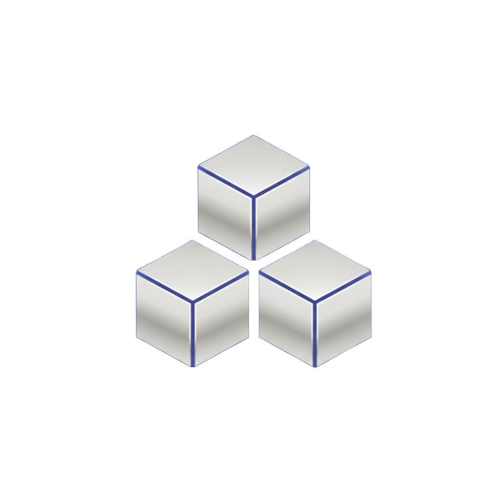

<p align="center">
  
</p>

<h1 align="center">StokFlow</h1>

<p align="center">
  <strong>Omnichannel stok, sipariş, finans ve pazaryeri operasyon paneli</strong><br>
  FastAPI · React · Vite · SQLAlchemy
</p>

<p align="center">
  
  
  
  
  
  
</p>

<p align="center">
  Trendyol · Hepsiburada · N11 · Amazon · AliExpress · Pazarama
</p>

<p align="center">
  <a href="#özellikler">Özellikler</a> ·
  <a href="#ekran-görüntüleri">Ekranlar</a> ·
  <a href="#kurulum">Kurulum</a> ·
  <a href="#api-özeti">API</a> ·
  <a href="#teknoloji">Stack</a>
</p>

<p align="center">
  
</p>

---

## Nedir?

StokFlow, tek satıcının birden fazla pazaryerini **tek panelden** yönetmesi için tasarlanmış yerel bir operasyon platformudur. Stok, sipariş, fatura/irsaliye PDF, kargo, kampanya, yorum ve finansal analitik aynı arayüzde toplanır.

> Eğitim ve iç operasyon amaçlıdır. Coded by **ensignalp** 

<table>
  <tr>
    <td align="center" width="25%"><strong>6</strong><br><sub>Pazaryeri adaptörü</sub></td>
    <td align="center" width="25%"><strong>10</strong><br><sub>Uygulama sayfası</sub></td>
    <td align="center" width="25%"><strong>70+</strong><br><sub>API ucu</sub></td>
    <td align="center" width="25%"><strong>abavf</strong><br><sub>AI asistan + SEO</sub></td>
  </tr>
</table>

---

## Özellikler

### Panel

Satış performansı, kanal dağılımı, akıllı stok tahmini, en çok satanlar ve canlı sipariş akışı.

- Bugünkü satış, aktif sipariş, düşük stok ve toplam ciro KPI’ları
- Zaman aralığı: 1 gün / 1 ay / 3 ay / 6 ay / 1 yıl / 2 yıl
- Kanal dağılımı (Trendyol, Hepsiburada, Amazon, Diğer)
- En çok satanlar ve kritik stok listesi
- **Stok tahmini:** son 30 gün satış hızından kalan gün, kritik / uyarı / güvenli, önerilen sipariş
- Panel üzerinden hızlı ürün ekleme ve senkron

### Ürün ve katalog

Liste / kart görünümü, XML aktarım ve 4 sekmeli ürün sihirbazı.

| Alan        | Ne yapar                                                                              |
| ----------- | ------------------------------------------------------------------------------------- |
| CRUD        | SKU, ad, slug, fiyat, stok, para birimi, kritik eşik                                  |
| Medya       | Görsel sürükle-bırak, açıklama                                                        |
| Fiyat       | Maliyet, KDV, satır içi fiyat/stok düzenleme                                          |
| Varyant     | Renk / beden / hafıza kombinasyonu, SKU, fiyat farkı                                  |
| SEO         | Meta title / description, AI başlık ve açıklama (Profesyonel / Yaratıcı / Minimalist) |
| Hiyerarşi   | Sınırsız derinlikli kategori, marka                                                   |
| Toplu işlem | Arama, filtre, sıralama, toplu silme                                                  |

**Yeni ürün sekmeleri:** Genel & Medya → Fiyat & Stok → Varyantlar → SEO & Pazaryeri

### XML katalog

- Dosyadan `.xml` yükleme
- URL’den çekip senkron
- Örnek tedarikçi şablonu
- Dışa aktarma şablonları: `GENERIC`, `TRENDYOL`, `HEPSIBURADA`, `N11`
- Canlı feed URL’si, token üret / yenile, panoya kopyala, önizleme

### Sipariş

KPI’lar, durum filtresi, kalemler ve belge üretimi.

| Durum             | Anlam                    |
| ----------------- | ------------------------ |
| `pending`         | Bekliyor                 |
| `hazirlaniyor`    | Hazırlanıyor             |
| `paketlendi`      | Paketlendi / etiketlendi |
| `kargoya_verildi` | Kargoda                  |
| `completed`       | Tamamlandı               |
| `cancelled`       | İptal                    |

- Kalemler: SKU, adet, birim fiyat, satır toplamı
- Müşteri verisi, kupon, indirim, pazaryeri kaynağı, takip no
- Fatura PDF · irsaliye PDF · Code128 barkod / kargo etiketi
- Toplu PDF birleştirme
- Toplu seçim / silme

> PDF’ler iç operasyon belgesidir; resmi e-Fatura / e-İrsaliye (GİB) değildir.

### Kargo ve lojistik

**Aras · Yurtiçi · MNG · DHL · UPS · FedEx**

- Sevkiyat hazırlama ve takip numarası
- Zaman çizelgesi: hazırlanıyor → paketlendi → şube → yolda → dağıtımda → teslim
- Manifest, desi hesabı, akıllı taşıyıcı atama
- İlçe kara listesi (sınır / acenta kapalı)

### Pazaryeri entegrasyonu

API anahtarları **Fernet** ile şifrelenir. `MARKETPLACE_LIVE_HTTP` kapalıysa simülasyon, açıksa canlı HTTP.

| Kanal       | Destek                                 |
| ----------- | -------------------------------------- |
| Trendyol    | Sipariş senkron, stok, durum, kampanya |
| Hepsiburada | Sipariş, stok, merchant ID             |
| N11         | Sipariş, stok                          |
| Amazon      | SP-API adaptörü, seller ID             |
| AliExpress  | Adaptör                                |
| Pazarama    | Adaptör                                |

- CRUD, aktif/pasif, merchant / supplier ID
- Otomatik yorum yanıtı + kişilik prompt’u
- SKU stok sorgula / güncelle
- Sandbox kimlik doğrulama
- Ping matrisi (gecikme, sağlık, rate-limit)

### Kampanya ve pazarlama

- Kampanya tipleri: sepet indirimi, 3 al 2 öde, sabit fiyat
- Pazaryeri senkronu, tarih aralığı, aç/kapa
- IF/THEN kural motoru (sepet adedi, tutar, gün)
- Kupon: yüzde / sabit, min sepet, kullanım limiti, son tarih
- Terk sepet hatırlatması (1. saat e-posta, 24. saat kuponlu SMS)
- Segmentler: VIP, Aktif, Riskli / Churn

### Yorumlar ve soru-cevap

- Pazaryeri yorum / soru listesi, yıldız, kanal
- `PENDING` / `ANSWERED`
- Manuel yanıt veya Gemini otomatik yanıt
- Mağaza kişilik prompt’u, simüle yorum

### Finans ve analiz

| Sekme                  | İçerik                                   |
| ---------------------- | ---------------------------------------- |
| Portföy & Nakit Kasa   | Portföy trendi, hak ediş + kasa dağılımı |
| Kâr / Zarar & Ciro     | Kategori performansı, benchmark          |
| Risk & İade            | Yoğunlaşma, vade, iade / hasar           |
| Hak Ediş & Transferler | Hak ediş, komisyon, kargo, reklam, iade  |
| Pazaryeri Metrikleri   | Kanal ciro / komisyon                    |
| Mağaza Vadeleri        | TY 14g · HB 7g · Amazon 14g · N11 21g    |
| Finansal Raporlar      | Mutabakat, KDV, komisyon                 |

TCMB kur servisi, USD / EUR / GBP dönüşüm, BDDK taksit ve kapıda ödeme kuralları.

### Depo, B2B ve kurumsal

- Çoklu depo (merkez / şube) ve depo stoku
- Bayi: VKN, kredi limiti, açık bakiye, Bronz → Platin iskonto
- Önbellek invalidation, Cloudflare CDN
- RBAC (`products:view`, `orders:view`, `finance:full_access` …)
- API token + IP whitelist
- Webhook: `order.created`, `stock.low`, `price.updated`
- Zamanlayıcı: TCMB, stok senkron, terk sepet
- Toplu PDF, otomatik SEO

### Yapay zeka

- Ürün açıklaması ve başlık SEO (ton seçimli)
- Yorum / soru yanıtı
- Sayfa bağlamlı sohbet asistanı (küçült / büyüt, hazır öneriler)
- Gemini yoksa mock moda düşer

### Paketler

| Plan               | Aylık  | Yıllık / ay | Kapsam                                  |
| ------------------ | ------:| -----------:| --------------------------------------- |
| Starter            | ₺390   | ₺290        | 1 pazaryeri, 500 ürün, günde 1 eşitleme |
| Growth             | ₺790   | ₺590        | 3 kanal, 5.000 ürün, 15 dk senkron      |
| **Enterprise Pro** | ₺1.890 | ₺1.490      | Aktif paket · AI yanıt · yüksek hacim   |

### Profil

- Avatar, mağaza hesabı
- Çoklu IBAN (varsayılan hesap, kopyala)
- Banka listesi ve hesap türleri (hakediş, USD, EUR, vergi / SGK)

### Sistem ayarları

1. Genel & Tema — mağaza, KEP, MERSİS, kurlar  
2. Sipariş & BDDK — checkout, misafir, taksit  
3. POS & E-Fatura — PayTR / İyzico, entegratör, IBAN  
4. Kargo & Depo — API, desi, akıllı atama  
5. Katalog & Stok — stok düşme anı, varyant  
6. Kampanya & Cron — terk sepet, ParaPuan  
7. Yetki & Güvenlik — RBAC, 2FA, IP  
8. Pazaryeri API — kanal anahtarları  
9. SEO & Loglar — GA4, Meta Pixel, sitemap  

### Arayüz

Açık / koyu tema · komut paleti (`↑↓ Enter Esc`) · toast · boş durum · hata sınırı · özel select / switch / tooltip · sağ tık menüsü · bildirim sesi · CDN’siz pazaryeri logoları

---

## Ekran Görüntüleri

<p align="center">
  <a href="#panel">Panel</a> ·
  <a href="#finans-ve-analiz">Finans</a> ·
  <a href="#ürünler">Ürünler</a> ·
  <a href="#siparişler">Siparişler</a> ·
  <a href="#entegrasyon">Entegrasyon</a> ·
  <a href="#kampanyalar">Kampanyalar</a> ·
  <a href="#yorumlar">Yorumlar</a> ·
  <a href="#paketler">Paketler</a> ·
  <a href="#profil">Profil</a>
</p>

### Panel

<p align="center">
  
</p>

### Finans ve Analiz

#### Portföy ve Nakit Kasa

<p align="center">
  
</p>

#### Kâr / Zarar ve Ciro

<p align="center">
  
</p>

#### Risk ve İade Analizi

<p align="center">
  
</p>

#### Hak Ediş ve Transferler

<p align="center">
  
</p>

#### Pazaryeri Metrikleri

<p align="center">
  
</p>

#### Mağaza Vadeleri

<p align="center">
  
</p>

#### Finansal Raporlar

<p align="center">
  
</p>

### Ürünler

#### Liste Görünümü

<p align="center">
  
</p>

#### Kart Görünümü

<p align="center">
  
</p>

#### XML Katalog — Dosya Yükle

<p align="center">
  
</p>

#### XML Katalog — URL ile Aktar

<p align="center">
  
</p>

#### XML Katalog — Canlı Çıktı

<p align="center">
  
</p>

#### Yeni Ürün — Genel ve Medya

<p align="center">
  
</p>

#### Yeni Ürün — Fiyat ve Stok

<p align="center">
  
</p>

#### Yeni Ürün — Varyantlar

<p align="center">
  
</p>

#### Yeni Ürün — SEO ve Pazaryeri

<p align="center">
  
</p>

### Siparişler

<p align="center">
  
</p>

### Entegrasyon

<p align="center">
  
</p>

#### Trendyol Bağlantısı

<p align="center">
  
</p>

### Kampanyalar

<p align="center">
  
</p>

### Yorumlar

<p align="center">
  
</p>

#### Manuel Yanıt

<p align="center">
  
</p>

### Paketler

#### Aylık Ödeme

<p align="center">
  
</p>

#### Yıllık Ödeme

<p align="center">
  
</p>

### Profil

<p align="center">
  
</p>

---

## Teknoloji

```
frontend (Vite :5173)  ──proxy──►  FastAPI (:8000)
     React 19                          SQLAlchemy + SQLite
     Tailwind + Recharts               ReportLab PDF
     Framer Motion                     Fernet · httpx · Gemini
```

| Katman   | Teknoloji                                            |
| -------- | ---------------------------------------------------- |
| API      | FastAPI, Pydantic, CORS, IP rate limit (120 / 60 sn) |
| Veri     | SQLAlchemy, SQLite (`omni_stock_local.db`)           |
| Güvenlik | Fernet (pazaryeri anahtarları), log maskeleme        |
| PDF      | ReportLab (fatura, irsaliye, barkod, toplu)          |
| AI       | Gemini `gemini-pro` (yoksa mock)                     |
| UI       | React 19, Vite 6, Tailwind, Recharts, Framer Motion  |

---

## Kurulum

**Gereksinim:** Python 3.11+

```bash
cd StokFlow
pip install -r requirements.txt
cp .env.example .env
```

**FERNET_KEY** (pazaryeri kaydı için zorunlu):

```bash
openssl rand -base64 32
```

Çıktıyı `.env` içine yazın. Anahtar boşsa ürün / sipariş / PDF çalışır; pazaryeri oluşturma / güncelleme **503** döner.

```bash
python -m uvicorn app.main:app --reload --host 127.0.0.1 --port 8000
```

API dokümantasyonu: [http://127.0.0.1:8000/docs](http://127.0.0.1:8000/docs)

### Frontend

Proxy: `frontend/vite.config.ts` → `/products`, `/orders`, `/marketplaces` → `127.0.0.1:8000`

```bash
cd frontend
npm install
npm run dev
```

Arayüz: [http://127.0.0.1:5173](http://127.0.0.1:5173)

Production veya `vite preview` için `frontend/.env` içine `VITE_API_URL=http://127.0.0.1:8000` yazın; backend `CORS_ORIGINS` içinde origin olmalı.

> `GET /` statik `static/index.html` dönebilir. Geliştirme arayüzü için Vite portunu kullanın.

---

## API özeti

| Alan       | Uçlar                                                                           |
| ---------- | ------------------------------------------------------------------------------- |
| Ürün       | `GET/POST /products/` · `GET/PUT/DELETE /products/{id}` · AI açıklama / başlık  |
| Sipariş    | CRUD · `/invoice` · `/receipt` · `/barcode` · `/prepare-shipment` · `/tracking` |
| Pazaryeri  | CRUD · sipariş senkron · stok GET/PUT · durum                                   |
| Katalog    | `POST/GET /categories` · `/brands`                                              |
| Kampanya   | kampanya / kupon CRUD · senkron                                                 |
| Kur        | `/rates` · `/convert`                                                           |
| Dashboard  | `/api/dashboard/stats` · `/charts` · `/forecasting`                             |
| Kargo      | taşıyıcılar · prepare · tracking · barkod · manifest                            |
| XML        | upload · import URL · sample · export şablon                                    |
| Yorum      | liste · simulate · reply                                                        |
| Enterprise | cache · CDN · RBAC · token · webhook · depo · TCMB · B2B · desi · batch PDF     |

Health: `GET /api/health` · Swagger: `/docs` · ReDoc: `/redoc`

---

## Test

```bash
pytest tests/
```

---

## Yasal not

PDF çıktıları iç operasyon belgesidir; **resmi e-Fatura / e-İrsaliye (GİB)** kapsamında değildir.

---

<p align="center">
  <sub>· Coded by <strong>Ensignalp</strong></strong></sub>
</p>
